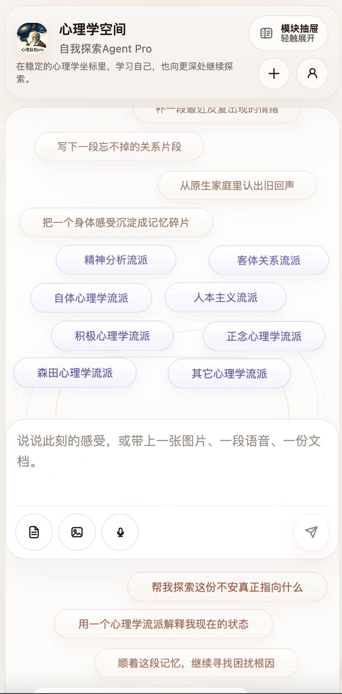
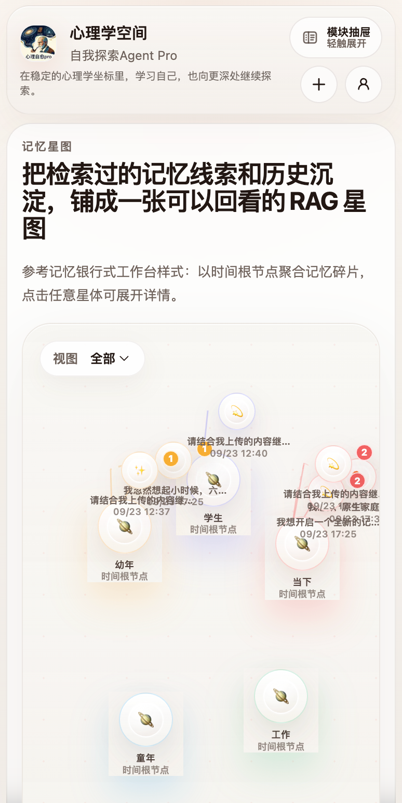
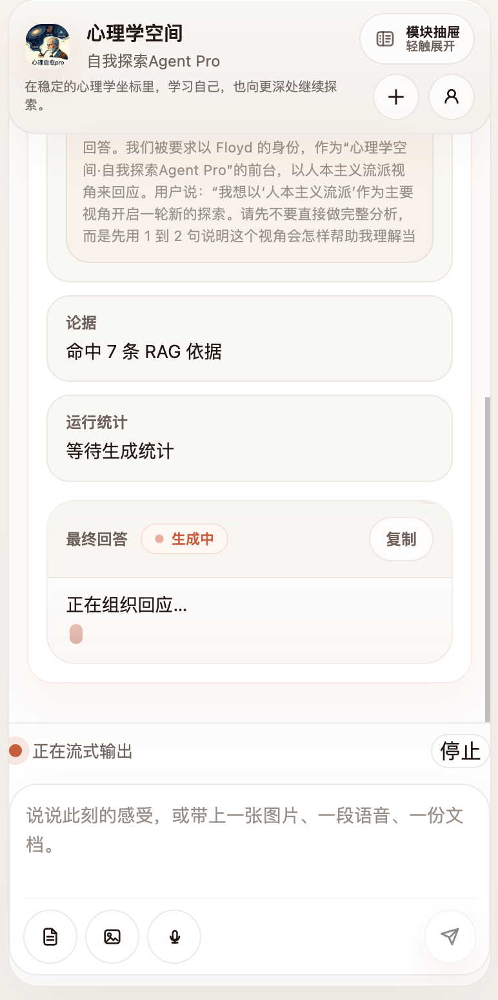
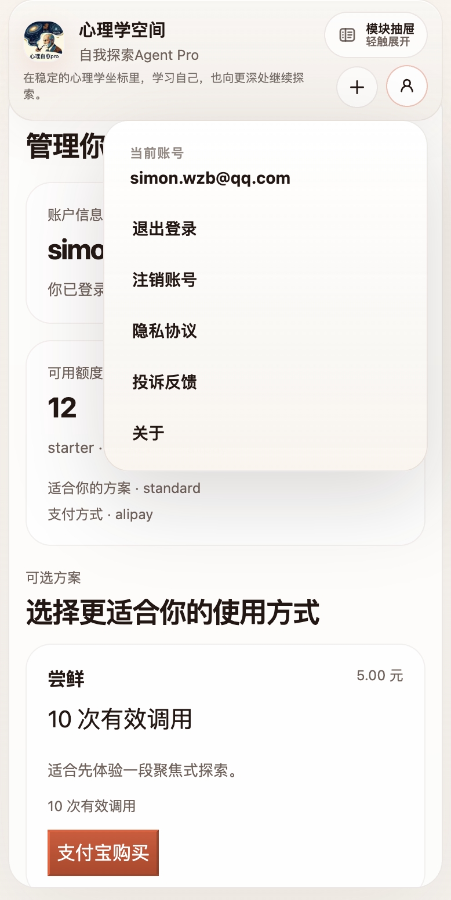
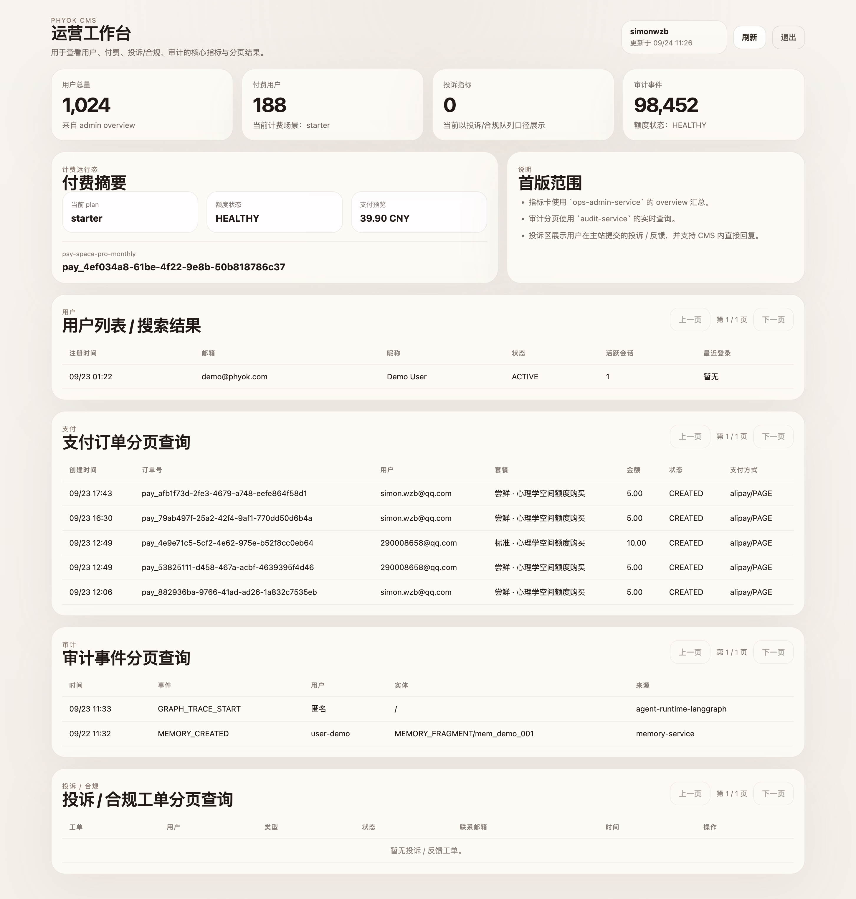

# 心理学空间·自我探索Agent Pro

🔗 在线访问：https://www.phyok.com

## H5 端预览

<p align="center">
  
  
  
  
</p>

<p align="center" style="color:#888;font-size:13px;margin-top:4px">首页对话 · 记忆星图 · 左侧栏 · 套餐支付</p>

## 1. 概述

### 核心功能

- 记忆系统：通过RAG管理记忆碎片、探索门槛校验、召回结果与星图数据结构；前端已具备“记忆星图”可视化面板。
- 用户与商业化：邮箱验证码登录、计费账户、套餐展示、支付宝下单、审计事件查询已经打通。
- Agent 编排：以 node(BFF) 中的自我探索流程为主线，围绕心理学学习、自我探索、潜意识与原生家庭、困扰根因等意图进行多轮对话，并完成意图识别、记忆门槛校验、记忆/知识召回、证据拼装、模型收口与 SSE 输出。
- 多模态输入：支持文本、图片、语音、文件等输入，并在 node(BFF) 层做统一预处理。
- 工程化部署：支持本地单服务运行、Docker Compose 整套联调，以及 K3s/K8s 远程部署与运维脚本。

## 2. 架构

### 架构摘要

这套架构不是为了“快速拼一个能跑的聊天 Demo”，而是为了支撑长期演进的 AI Agent Web 产品：

- 前端强调高质量交互、SSE 体验与多模态入口。
- Node 层强调流式输出、Agent 编排、BFF 聚合与快速迭代。
- Java 层强调领域建模、数据治理、工程化分层与长期稳定性。
- RAG 作为系统核心能力之一，被显式拆成“记忆碎片存储、门槛校验、召回、星图可视化、后续向量检索扩展”几个可独立演进的模块。
- 部署层选择 Compose + K3s/K8s，是为了兼顾本地联调效率、线上落地和后续扩容路径。

### RAG 技术选型与理由

#### 为什么把 RAG 做成独立能力层

- 本项目的 RAG 不只是“给大模型塞一点检索上下文”，而是承载用户长期记忆、探索门槛、证据依据与可视化表达的核心系统。
- 对心理学探索场景而言，记忆必须具备持续累积、可回看、可修复、可追踪来源的能力，因此不适合把所有状态都堆在单次对话上下文里。
- 把 RAG 显式拆层后，后续更容易做 embedding 升级、重排、聚类、星图布局优化、审计追踪和隐私擦除。

#### RAG 技术选型

- 结构化记忆主存储：`PostgreSQL`
  - 理由：关系型结构便于做记忆碎片、时间根节点、会话来源、审计链路和删除修复类操作。
- 向量检索扩展：`Qdrant`
  - 理由：适合承接记忆碎片与知识库的 embedding 检索，后续可平滑从当前轻量相似度策略升级到正式向量召回。
- 召回与门槛服务：`memory-service`
  - 理由：把记忆门槛校验、召回预览、星图构图放在 Java 领域服务层，更利于长期数据治理与接口稳定。
- 编排入口：`phyok-node2`
  - 理由：Node 层可以更自然地把“用户输入 -> 意图识别 -> 门槛校验 -> RAG 召回 -> SSE 输出”串成实时交互流程。

### Agent 编排与 RAG 核心

#### Agent 编排

- 主流程位于 `phyok-node2/src/packages/graph-flows/self-explore`。
- 当前编排不是单一 prompt，而是明确拆成：
  - 多模态预处理
  - 输入归一化
  - 风险识别
  - 意图路由
  - 记忆门槛校验
  - 记忆/知识召回
  - 证据拼装
  - 模型流式收口
- 这样拆分的理由是：
  - 便于 AI 代码 Review，流程节点边界清晰，不会把所有逻辑埋进一个大 prompt。
  - 便于后续独立替换某一段能力，例如换模型、换召回策略、增加新意图或接入新技能。
  - 便于做运行态观测和错误定位，降低系统演进中的熵增。

#### RAG 核心链路

- 用户输入到达 node(BFF) 后，先完成意图识别与风险判断。
- 如果命中探索类意图，先向 `memory-service` 做门槛校验，例如是否已达到最小记忆碎片数。
- 校验通过后，再执行记忆召回、知识召回和证据拼装。
- 拼装后的证据包不会直接替代系统提示，而是作为 Agent 最终输出阶段的依据输入。
- `memory-service` 还负责输出记忆星图所需的 `root / memory / peer` 图结构，前端再将其渲染为“记忆银行”式星图。
- 当前实现已经具备：
  - 记忆碎片持久化
  - 记忆门槛校验
  - 记忆召回与预览
  - 记忆星图接口
  - 前端星图展示
- 后续继续演进的方向包括：
  - 更正式的 embedding / rerank
  - timeline 聚类增强
  - peer link 相似度优化
  - 记忆修复、删除与隐私擦除链路完善

### Java 微服务架构

#### 技术选型

- 技术栈：`Java 21 + Spring Boot 3.3 + Spring Cloud 2023 + MyBatis + Flyway`

#### 选择理由

- Java 承担长期工程化领域能力，更适合沉淀鉴权、计费、支付、审计、记忆、租户和隐私治理。
- 微服务拆分有利于边界清晰和代码 review，例如 `auth-service`、`memory-service`、`payment-service` 可以独立演进。
- `MyBatis + XML Mapper` 使复杂 SQL 明确可见，更适合长期 review 与性能调优。
- `Flyway` 负责数据库迁移，保证数据结构的可追踪演进。

#### 当前 Java 服务分工

- `auth-service`：邮箱验证码登录、会话签发
- `memory-service`：记忆碎片、门槛校验、召回、星图
- `billing-service`：账户、额度、套餐
- `payment-service`：支付宝下单、订单查询、支付回调
- `audit-service`：审计事件写入与查询
- 其他服务：`tenant-service`、`privacy-service`、`knowledge-service`、`ops-admin-service`

### Node BFF / Agent Runtime

#### 技术选型

- 技术栈：`Node.js + Fastify + TypeScript + Zod`

#### 选择理由

- node(BFF) 作为统一 `/v2/*` 入口，更适合处理 SSE、流式输出、前端交互收口与多服务聚合。
- `Fastify` 在高并发 I/O、SSE、模块化路由上更适合聊天类场景。
- `TypeScript + Zod` 强化接口契约和运行时校验，减少 BFF 层的隐性变更风险。
- Node 层非常适合承接 Agent 编排，因为它天然贴近流式模型调用、多模态预处理和前端体验联动。

#### Node 层职责

- 统一承接前端 `/v2/*` 请求
- 负责 SSE 输出、停止生成、断线恢复、历史运行态维护
- 执行 Agent 编排主流程
- 代理或聚合 Java 域服务
- 对接 SiliconFlow / DeepSeek / 多模态模型

### 前端与部署

#### 前端

- 技术栈：`Next.js 15 + React 19 + TypeScript + Redux Toolkit`
- 选择理由：
  - `Next.js App Router` 适合 SSR、首屏性能、后续 SEO 与分模块扩展。
  - `React 19` 便于构建高交互密度的聊天 UI、登录弹窗、历史会话、星图面板等客户端模块。
  - `Redux Toolkit` 适合承载 SSE 流式状态、运行态、历史恢复、自动滚动、附件状态等复杂前端状态。
  - 当前前端主应用是 `phyok-web/apps/chat-web`，核心对话壳层在 `src/features/chat/ChatShell.tsx`。

#### 部署与运维

- 本地整套联调：`Docker Compose`
- 远程部署：`K3s/K8s + ingress-nginx + host Nginx`
- 选择理由：
  - 本地用 Compose 便于快速拉起 Web、Node、Java、PostgreSQL、Redis、Kafka、Qdrant。
  - 远程侧统一兼容 `K3s/K8s`，既能覆盖轻量单机落地，也能兼容标准 Kubernetes 集群。
  - 宿主机保留主 Nginx，统一处理 `80/443`、HTTPS 与域名入口，K3s/K8s 只承载应用工作负载。

### 当前服务分层

- `chat-web`：用户直接访问的聊天前端，负责输入、SSE 展示、历史会话、计费弹层、记忆星图 UI。
- `phyok-node2`：统一 API 入口、SSE 输出、Agent 流程编排、多模态预处理、Java 服务代理，也就是这里文档中所说的 `node(BFF)`。
- `phyok-java`：
  - `auth-service`：邮箱验证码登录与会话签发
  - `memory-service`：记忆碎片、门槛校验、召回、星图
  - `billing-service`：账户、额度、套餐
  - `payment-service`：支付宝下单与订单查询
  - `audit-service`：审计事件写入与查询
  - 其他：`tenant-service`、`privacy-service`、`knowledge-service`、`ops-admin-service`
- `deploy`：Compose、K3s/K8s、Nginx 与运维脚本

### CMS 运营后台

<p align="center">
  
</p>

<p align="center" style="color:#888;font-size:13px;margin-top:4px">CMS 运营后台：用户、付费订单、投诉反馈、审计事件一站式管理</p>

## 3. 运行与部署

### 环境准备

建议先准备以下环境：

- Node.js 20+
- npm 10+
- Java 21
- Docker / Docker Compose
- K3s/K8s 部署时：Ubuntu 22.04 + 已开放 `80`、`443`、`6443`

根目录统一环境文件约定：

```bash
cp env2.example env2
```

说明：

- 根目录 `env2` 已被 `.gitignore` 忽略，不应提交到 Git。
- `phyok-node2` 还支持 `env2.local`、`env2.prod` 等按环境覆盖的文件命名。

### 本地运行：前端 + node(BFF) + 单服务

#### 1. 启动 chat-web

```bash
cd phyok-web/apps/chat-web
npm install
npm run dev
```

默认访问：

- `http://127.0.0.1:3001`

#### 2. 启动 node(BFF)

```bash
cd phyok-node2
npm install
npm run dev
```

默认访问：

- `http://127.0.0.1:3002`

#### 3. 启动本地 memory-service

当前仓库已提供本地脚本，会自动处理 JDK 21、Docker PostgreSQL 与 `memory-service`：

```bash
cd phyok-java
./scripts/run-memory-service-local.sh
```

默认访问：

- `http://127.0.0.1:18182`

适合场景：

- 调试记忆碎片接口
- 调试记忆星图后端图谱接口
- 调整 `chat-web -> node(BFF) -> memory-service` 的真实联调

### 本地运行：Docker Compose 整套联调

推荐入口：

```bash
cd deploy/compose
../../deploy/scripts/deploy.sh all
```

如需手动执行 Compose：

```bash
cd deploy/compose
docker compose -f docker-compose.prod.yml --env-file ../../env2 up --build
```

默认入口：

- Frontend: `http://127.0.0.1:3001`
- node(BFF): `http://127.0.0.1:3002`
- Auth Service: `http://127.0.0.1:18081`
- Billing Service: `http://127.0.0.1:18085`
- Audit Service: `http://127.0.0.1:18087`

推荐体验顺序：

1. 打开首页
2. 邮箱登录
3. 发起一轮聊天
4. 查看计费与审计
5. 切换到“记忆星图”查看图谱

### 远程部署：K3s/K8s

#### 方案 A：宿主机已有 Nginx，推荐

```bash
cd /path/to/phyok
./deploy/scripts/k3s-install-host-nginx.sh
PUBLIC_HOST=www.phyok.com ./deploy/scripts/k3s-project-up.sh
```

#### 方案 B：从安装到发布一步完成

```bash
cd /path/to/phyok
PUBLIC_HOST=www.phyok.com ./deploy/scripts/k3s-all-in-one-host-nginx.sh
```

#### 方案 C：拆步执行

1. 安装 K3s/K8s

```bash
./deploy/scripts/k3s-install.sh
```

2. 构建并导入镜像

```bash
./deploy/scripts/k3s-load-images.sh node
./deploy/scripts/k3s-load-images.sh java
```

3. 发布

```bash
PUBLIC_HOST=api.your-domain.com ./deploy/scripts/k3s-deploy.sh all
```

4. 配置 TLS

```bash
./deploy/scripts/k3s-apply-tls.sh api.your-domain.com /path/to/fullchain.pem /path/to/privkey.pem
```

### 部署后运维

#### Compose 运维

查看日志：

```bash
./deploy/scripts/logs.sh all
```

健康检查：

```bash
./deploy/scripts/healthcheck.sh all
```

更新服务：

```bash
./deploy/scripts/update.sh all
```

清理：

```bash
./deploy/scripts/cleanup.sh all
```

#### K3s/K8s 运维

查看运行状态：

```bash
kubectl get pods -n phyok
kubectl get svc -n phyok
kubectl get ingress -n phyok
```

查看 K8s 日志：

```bash
./deploy/scripts/k8s-logs.sh all
```

滚动重启：

```bash
./deploy/scripts/k8s-rollout.sh all
```

健康巡检：

```bash
./deploy/scripts/k3s-healthcheck.sh all
```

备份 PostgreSQL：

```bash
./deploy/scripts/k3s-backup-postgres.sh
```

安装定时巡检与备份：

```bash
BACKUP_CRON="0 3 * * *" HEALTHCHECK_CRON="*/10 * * * *" ./deploy/scripts/k3s-install-cron.sh all
```

## 4. env2 Example 模板

根目录已提供脱敏模板：

```bash
cp env2.example env2
```

模板覆盖以下几类配置：

- 基础端口与对外 URL
- PostgreSQL / Redis / Kafka / Qdrant
- node(BFF) / chat-web / 本地调试
- Auth 邮件验证码
- Billing / Payment
- SiliconFlow / 大模型 / 多模态
- K3s/K8s / 告警 / 运维辅助项

重点说明：

- `SILICONFLOW_API_KEY` 为 node(BFF) 实际调用模型的关键变量。
- `TENCENT_SES_*` 为邮箱验证码发送必填变量。
- `ALIPAY_*` 为开启真实支付宝链路时必填变量。
- 若暂时只做本地 UI 或前后端联调，可先保留为空或使用降级模式，但生产环境必须填写完整。

## 5. 其它重要说明

### 安全

- `env2` 现在只应保留在本地或服务器，不再提交 Git。
- 如果历史中曾出现真实密钥，建议同步轮换相关密钥。
- 支付、邮件、模型服务等生产凭证应优先通过安全渠道发放和更新。

### 接口约定

- 新系统主接口统一走 `/v2/*`
- `/app/*` 仅保留旧系统兼容，不再作为新系统主入口

### 本地与生产配置

- `chat-web` 在开发态会通过 Next.js rewrite 把 `/v2/*` 转发到本地 node(BFF)
- `node(BFF)` 支持通过根目录 `env2`、`env2.local`、`env2.prod` 等方式做环境覆盖
- K3s/K8s 发布时，`deploy/scripts/k8s-apply-env.sh` 会把根目录 `env2` 同步到 `phyok-platform-secret`

### 当前主链路

当前仓库已经打通的主链路包括：

- Web 聊天输入与 SSE 输出
- thinking 展示、停止生成、断线恢复
- 邮箱验证码登录
- 计费账户与套餐获取
- 支付宝下单与订单查询
- 审计事件查询
- 记忆门槛校验、记忆图谱与记忆星图展示

### 推荐阅读

- 前端架构：`phyok-web/docs/architecture/FRONTEND_MONOREPO_ARCHITECTURE.md`
- 聊天应用架构：`phyok-web/docs/architecture/CHAT_WEB_APP_ARCHITECTURE.md`
- 流式状态架构：`phyok-web/docs/architecture/FRONTEND_STATE_STREAMING_ARCHITECTURE.md`
- node(BFF) 说明：`phyok-node2/README.md`
- Compose 说明：`deploy/compose/README.md`
- K3s/K8s 说明：`deploy/k8s/SINGLE_NODE_K3S_GUIDE.md`
