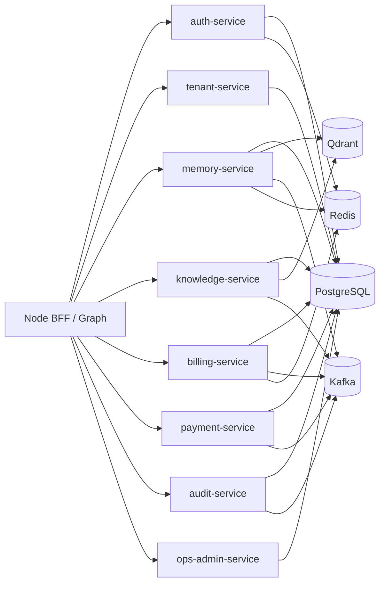

# 《心理学空间·自我探索Agent Pro》Java Spring Cloud 业务域架构说明

## 1. 文档定位

本文定义 Java 侧的正式角色：

- 不做主 LangGraph Runtime
- 不做主 SSE 层
- 专注稳定业务域、微服务治理和工程化落地

Java 在这里是**稳定控制面 + 业务真相层**。

---

## 2. 一句话结论

Java 负责：

- 登录鉴权
- 多租户
- 记忆与知识主数据
- RAG 索引主流程
- 支付与账务
- 审计与投诉
- CMS / 运营后台
- Kafka / Redis / PG / Qdrant 的稳定工程整合
- Spring Cloud 微服务治理

Node 负责前台交互运行时，Java 负责后台稳定业务域。

---

## 3. 为什么 Java 仍然是主业务中台

因为你的系统后期最难的不是“怎么把模型跑起来”，而是：

- 多租户边界
- 主账本
- 审计回放
- 订单与支付
- 数据删除
- CMS 管理
- 微服务治理

这些问题天然更适合：

- `Spring Boot`
- `Spring Cloud`
- `MyBatis`
- `PostgreSQL`
- `Kafka`
- `Redis`

---

## 4. 不使用 Spring AI 作为主运行时

结论：

- Java 侧**不采用 `Spring AI` 作为主 Agent 编排框架**

原因：

- 你的主编排明确要用 `LangGraph`
- 如果 Java 再引入 `Spring AI` 主链路，会形成双 Runtime
- 双 Runtime 会让：
  - 审计口径混乱
  - 工具链重复
  - 问题定位复杂

保留策略：

- `Spring AI` 可以作为实验能力
- 但不进入生产核心链路

---

## 5. Java 服务清单

## 5.1 `auth-service`

职责：

- 登录
- JWT 主签发
- Refresh Token
- 设备会话
- 用户身份主数据

## 5.2 `tenant-service`

职责：

- 租户
- 应用
- 配额基线
- 多租户元数据

## 5.3 `memory-service`

职责：

- 记忆碎片主数据
- 关系维护
- 记忆入库主流程
- embedding / rerank / 索引任务发起
- Qdrant 回表 enrich

## 5.4 `knowledge-service`

职责：

- 文档主表
- 文档 chunk 主表
- 文档索引任务
- 文档检索

## 5.5 `billing-service`

职责：

- token 使用事件入账
- 配额
- 套餐
- 主账本
- 日月账单

## 5.6 `payment-service`

职责：

- 支付订单
- 回调
- Apple IAP / 第三方支付主流程
- 与账务对账

## 5.7 `audit-service`

职责：

- 审计事件
- 审计轨迹
- 对话回放
- 风险标注
- 投诉证据链

## 5.8 `privacy-service`

职责：

- 删除任务主编排
- 多服务删除补偿
- 删除审计

## 5.9 `ops-admin-service`

职责：

- CMS 后台
- 用户 / 付费 / 投诉 / 审计 / 资源指标
- 配置与运营开关

---

## 6. Java 依赖图

---

## 7. MyBatis 规范

Java 侧持久层统一结论：

- **使用 `MyBatis + XML Mapper`**

不使用：

- 大而泛的 ORM 自动魔法
- 复杂 query 交给注解拼字符串

## 7.1 为什么选 MyBatis

因为你明确要求：

- 易 review
- 可控
- 不堆砌代码
- ORM 规范清晰

MyBatis 最适合：

- 复杂分页
- 审计回放
- CMS 列表查询
- 多条件筛选
- 批量更新
- 读写分离明确控制

## 7.2 层次规范

推荐：

- `controller`
- `application service`
- `domain service`
- `repository interface`
- `mapper xml`

要求：

- `controller` 不写业务规则
- `mapper` 不承载业务判断
- 复杂 SQL 一律进 XML
- Service 不直接拼 SQL

## 7.3 SQL 规范

- 所有分页 SQL 必须显式排序字段
- 所有高频筛选 SQL 必须有联合索引说明
- Mapper XML 每个查询都写用途注释
- 不允许大面积 `select *`

---

## 8. 数据库职责

## 8.1 PostgreSQL

Java 是 PG 主拥有者。

主表包括：

- 用户
- 租户
- 会话
- 记忆碎片
- 知识文档
- 订单
- 账单
- 审计
- 投诉
- CMS 指标投影

## 8.2 Qdrant

Java 负责：

- 触发索引任务
- 持有 payload 约束
- 回表 enrich

Node 不直接拥有 Qdrant 真相逻辑。

## 8.3 Redis

Java 用于：

- 会话缓存
- 配额热点缓存
- 幂等控制
- 分布式锁

---

## 9. Kafka 规范

Java 侧 Kafka 主题建议：

- `memory.fragment.created`
- `memory.embedding.requested`
- `knowledge.index.requested`
- `billing.usage.recorded`
- `billing.charge.completed`
- `audit.trace.recorded`
- `payment.callback.received`
- `privacy.delete.requested`

原则：

- 同步链路只做必要校验
- 重任务异步化

---

## 10. 多租户与鉴权

## 10.1 多租户主控制面

Java 统一掌控：

- `tenant_id`
- `app_id`
- `user_id`
- `role`
- `plan`

## 10.2 JWT 规范

JWT claim 建议包含：

- `sub`
- `tenant_id`
- `app_id`
- `role`
- `session_id`

Node 只消费这些 claim，不再定义第二套身份语义。

---

## 11. RAG 与记忆检索

Java 侧负责：

- 记忆碎片主表
- 文档主表
- chunk 主表
- embedding 任务编排
- Qdrant 检索契约
- 回表 enrich

Node LangGraph 负责：

- 在一轮会话中决定何时检索
- 如何消费检索结果

因此：

- 检索决策在 Node
- 检索真相在 Java

---

## 12. 支付、账务、审计、CMS

## 12.1 支付

Java 是主支付中心。

可复用旧 `phyok-node` 的：

- 支付适配经验
- Apple IAP 逻辑片段

但正式落地在：

- `payment-service`

## 12.2 账务

Java `billing-service` 是唯一主账本。

## 12.3 审计

Java `audit-service` 是唯一主审计中心。

Node 只发审计事件，不持有主审计真相。

## 12.4 CMS

Java `ops-admin-service` 负责：

- 用户
- 付费
- 投诉
- 审计
- 资源指标

---

## 13. 日志与可观测

Java 侧日志必须结构化：

- `trace_id`
- `tenant_id`
- `app_id`
- `user_id`
- `request_id`
- `service`
- `event_name`
- `latency_ms`

监控建议：

- `Micrometer`
- `Prometheus`
- `Grafana`

---

## 14. Spring Cloud 治理建议

推荐：

- `Nacos`
- `OpenFeign`
- `Resilience4j`
- `Spring Cloud LoadBalancer`

根据资源情况决定是否加：

- `Sentinel`

原则：

- 治理能力放 Java 微服务层
- 不强迫 Node 去承担微服务治理职责

---

## 15. Code Review 规则

- 一个 service 只拥有一类主数据写权限
- 一个 mapper xml 只做本服务的数据访问
- 不允许跨服务直接写表
- 不允许“通用基础服务类”吞掉业务语义
- DTO、DO、Query、Command 分开

---

## 16. 一句话结论

Java 在双后端主方案中不是 Agent Runtime，而是：

- **稳定业务域**
- **MyBatis 持久层**
- **Spring Cloud 微服务治理**
- **支付 / 账务 / 审计 / CMS / 多租户的主控制面**
