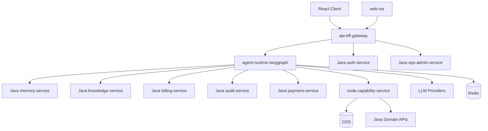

# 《心理学空间·自我探索Agent Pro》Node BFF + LangGraph 架构说明

## 1. 文档定位

本文专门定义 Node 侧的正式职责与分层方式。

Node 在当前主方案中不再只是“媒体能力补丁”，而是正式承担：

- BFF
- 外部 API 网关
- LangGraph Agent Runtime
- SSE 流式
- 长连接
- SSR 相关 Node Runtime
- 多模态能力

但同时必须保证：

- 分层明确
- 依赖图明确
- 易于 review
- 不堆砌代码

---

## 2. 一句话定位

Node 是整个系统的**交互运行时层**。

它负责：

- 离用户最近的协议层
- 离模型最近的 Agent 运行时

但它不负责：

- 大部分核心业务主数据真相
- 主账务
- 主审计
- 主鉴权

---

## 3. Node 服务拆分建议

## 3.1 `api-bff-gateway`

职责：

- 对外统一 `/v2/*`
- 前后端协议聚合
- 请求头整理
- 基础校验
- SSE 向浏览器输出

建议技术：

- `Fastify`
- `Zod`
- `pino`

## 3.2 `agent-runtime-langgraph`

职责：

- LangGraph.js 主编排
- 意图判断
- 调工具
- 调 Java 领域 API
- 调用 LLM
- 回传流式事件

建议技术：

- `LangGraph.js`
- `LangChain JS` 作为 provider/tool 适配

## 3.3 `node-capability-service`

职责：

- 文件解析
- OCR / ASR
- 图片理解
- 图片格式转换
- 风险预警
- 脱敏

## 3.4 `web-ssr`

职责：

- `Next.js App Router`
- SSR
- 前端服务端逻辑

---

## 4. Node 依赖图



依赖约束：

- `BFF` 不直接访问 PG/Qdrant 业务主表
- `Graph` 不直接访问 Java 数据库
- Node 只通过 Java 公开 API 使用业务能力

---

## 5. 分层规范

推荐目录：

```text
node-backend/
  apps/
    api-bff-gateway/
    agent-runtime-langgraph/
    node-capability-service/
    web-ssr/
  packages/
    config/
    contracts/
    domain-clients/
    graph/
    tool-adapters/
    model-adapters/
    shared/
```

## 5.1 `packages/config`

职责：

- 环境变量读取
- Zod 校验
- 默认值

要求：

- 所有 env 只允许从这里读取
- 不允许在业务代码里直接 `process.env.xxx`

## 5.2 `packages/contracts`

职责：

- Node 与 Java 的 DTO
- 错误码
- 事件结构

## 5.3 `packages/domain-clients`

职责：

- Java 领域 API Client
- Auth / Memory / Knowledge / Billing / Audit / Payment / Admin

要求：

- 一服务一 client
- 只做协议转换，不做业务决策

## 5.4 `packages/graph`

职责：

- LangGraph 图定义
- 节点定义
- 路由器
- graph state

要求：

- Graph 定义 declarative
- 一个图一个入口
- 一个节点一个文件或一个职责组

## 5.5 `packages/tool-adapters`

职责：

- Graph 节点真正调用的工具适配器
- Java API Tool
- Node Capability Tool

要求：

- 一工具一文件
- 输入输出严格 schema 化

---

## 6. LangGraph 运行时规范

## 6.1 设计结论

`LangGraph.js` 是系统唯一主 Agent Runtime。

图中节点只做 4 类事：

- 读取上下文
- 调 Java 领域服务
- 调 Node 能力服务
- 调 LLM

## 6.2 不允许的做法

- 节点里直接写数据库
- 节点里直接塞大量业务规则
- 节点里直接拼装 HTTP 协议细节

## 6.3 推荐节点类型

- `intent_router`
- `memory_gate_checker`
- `memory_retriever`
- `knowledge_retriever`
- `agent_reasoner`
- `response_streamer`
- `audit_event_emitter`

---

## 7. SSE 与长连接规范

## 7.1 为什么放 Node

因为：

- LangGraph 事件天然适合 Node 流式转发
- 浏览器 SSE / 长连接处理在 Node 更轻量
- 输出 token 流、tool 事件流、citation 事件流在 Node 更自然

## 7.2 输出事件建议

- `message.delta`
- `tool.started`
- `tool.completed`
- `citation.appended`
- `warning.raised`
- `message.completed`

## 7.3 状态存储

运行时状态建议：

- 短期态：`Redis`
- 业务真相：交给 Java

不建议：

- 进程内 `Map` 当主状态仓

---

## 8. BFF 规范

## 8.1 BFF 的职责

- 聚合多个 Java 服务返回
- 聚合 Graph 返回
- 统一给前端一个稳定协议

## 8.2 BFF 不做什么

- 不承载主业务规则
- 不直接改主业务表
- 不把 Java 领域逻辑复制一份在 Node

## 8.3 为什么一定需要 BFF

因为前端并不应该同时理解：

- LangGraph 事件流
- Java 多个微服务的碎片接口
- 多模态任务状态

BFF 的价值是把这些统一成前端可消费协议。

---

## 9. 鉴权与多租户

## 9.1 鉴权结论

- JWT 主签发：Java
- Node 只校验并转发身份上下文

## 9.2 多租户上下文

Node 每次下游调用必须带：

- `tenant_id`
- `app_id`
- `user_id`
- `request_id`

Node 不自己定义第二套租户规则。

---

## 10. 支付、审计、计费在 Node 中的角色

## 10.1 支付

- Node 只做前端交互友好的 BFF 聚合
- 真正支付主流程、订单、账务仍在 Java

## 10.2 审计

- Node 负责发送运行时事件
- Java `audit-service` 负责落库和回放

## 10.3 计费

- Node 输出 token 使用和模型使用事件
- Java `billing-service` 负责主账本

---

## 11. ORM / 数据访问规范

Node 原则上不直接操作 Java 主业务库。

### 11.1 Node 直连数据库的范围

只允许两类：

- `Redis`
- Node 自己的 runtime/checkpoint schema

### 11.2 如果 Node 必须访问 PG

推荐：

- `Kysely`

原因：

- 类型清晰
- SQL 显式
- 比重量 ORM 更适合 review

不建议：

- 把 Node 做成第二套主业务 ORM 层

---

## 12. 从 `phyok-node` 摘取什么

建议摘取：

- 文件处理逻辑
- 图片处理逻辑
- 语音处理逻辑
- 风险预警
- 脱敏逻辑
- 环境变量命名
- 邮件适配
- 某些好用的 prompt / 模板

不建议直接继承：

- 历史 Mongo 耦合
- 历史主路由组织
- 进程内状态设计
- 历史主业务写库方式

一句话：

- 复用资产，不继承耦合

---

## 13. Code Review 规则

- 一个 Graph 文件只定义一个图
- 一个 Tool Adapter 只做一个工具
- 一个 Client 只代理一个 Java 服务
- 所有 env 统一 schema 校验
- 所有外部 I/O 都要可 mock
- 不允许“万能 util.ts”膨胀
- 不允许在 BFF 里复制 Java 业务规则

---

## 14. 一句话结论

Node 在新架构中不是补丁，而是：

- **交互运行时**
- **LangGraph 编排层**
- **SSE / 长连接 / BFF / SSR 层**

但它必须建立在**清晰分层、强约束依赖和轻持久化策略**之上。
