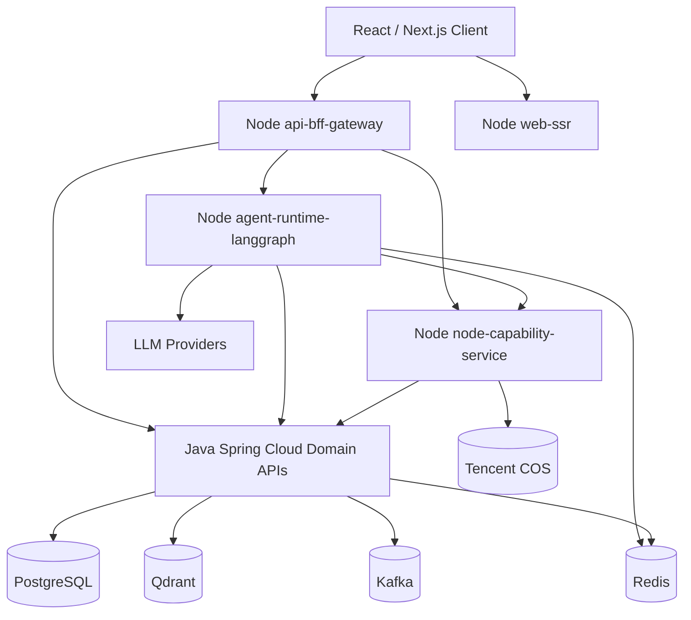
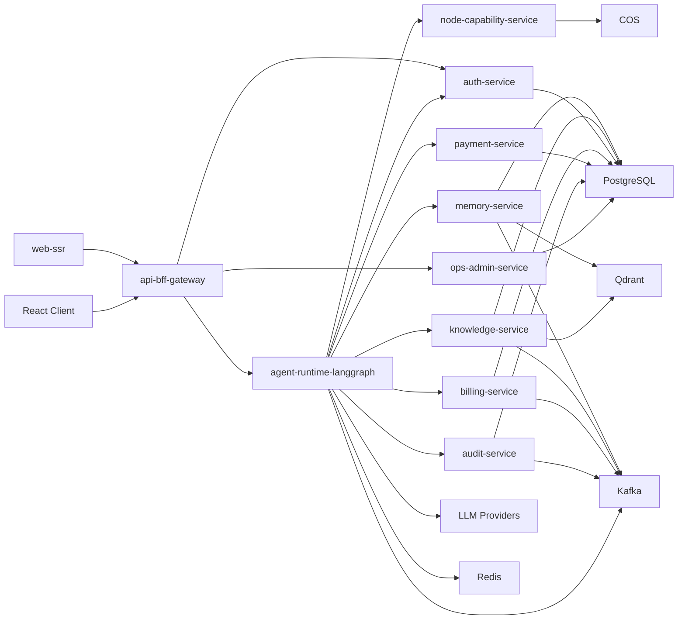

# 《心理学空间·自我探索Agent Pro》Node + Java 双后端总架构

## 1. 文档定位

本文是当前主架构总纲。

目标不是继续在“Java 主控、Node 只做能力服务”那条线上修补，而是正式切换到：

- `Node` 负责交互运行时
- `Java Spring Cloud` 负责稳定业务域

适用范围：

- React 单聊天框产品
- 多模态输入
- LangGraph Agent 编排
- RAG / 记忆碎片检索
- 登录鉴权 / 多租户 / 支付 / 审计 / CMS
- Docker 单机上线与后续 K8s 演进

---

## 2. 一句话结论

正式生产架构建议采用：

- **Node 层**
- `api-bff-gateway`
- `agent-runtime-langgraph`
- `node-capability-service`
- `web-ssr`（Next.js Node Runtime）

- **Java 层**
- `auth-service`
- `tenant-service`
- `memory-service`
- `knowledge-service`
- `billing-service`
- `payment-service`
- `audit-service`
- `ops-admin-service`
- `privacy-service`

- **基础设施层**
- `PostgreSQL`
- `Qdrant`
- `Redis`
- `Kafka`
- `COS`

核心原则：

- `Node` 做它擅长的交互、流式、LangGraph、I/O、SSR
- `Java` 做它擅长的强事务、强审计、强治理、强业务稳定性

---

## 3. 为什么切到双后端

你的产品不是普通 CRUD 系统，也不是纯 AI Demo。

它天然分成两类完全不同的问题：

### 3.1 Node 更擅长的

- BFF 聚合
- API 网关外层编排
- SSE 流式输出
- 长连接
- Agent Runtime
- LangGraph.js
- 多模态 I/O
- SSR 交互响应

### 3.2 Java 更擅长的

- 微服务治理
- 多租户强隔离
- 登录鉴权主控制面
- 账务主账本
- 支付与订单
- 审计与回放
- CMS / 运营后台
- Kafka / Redis / PG / Qdrant 的稳定工程整合

如果强行单栈，会出现两个问题：

- 全部压到 Node，后期业务治理会变脆
- 全部压到 Java，LangGraph / SSE / 长连接 / BFF 会变笨重

所以双后端不是“技术炫技”，而是为了把不同性质的复杂度拆开。

---

## 4. 顶层分层

---

## 5. 职责边界

## 5.1 Node 负责

- 外部 API 入口聚合
- BFF
- LangGraph.js Agent 编排
- SSE 流式响应
- 长连接会话运行时
- Next.js SSR 相关 Node Runtime
- 文件处理 / 图片理解 / 语音转写 / 图片预处理
- 从 `phyok-node` 中摘取可复用逻辑、提示词、适配器、环境变量规范

## 5.2 Java 负责

- 登录鉴权主中心
- 多租户主控制面
- 用户、租户、应用主数据
- 记忆碎片主数据
- 文档知识库主数据
- 支付、账务、配额
- 审计、投诉、运营后台
- 隐私清理主编排
- 微服务治理、配置中心、熔断、限流、服务发现

## 5.3 Node 不负责

- 核心业务表直接写入
- 主账务
- 主审计
- 主多租户权限判定
- 用户删除主编排

## 5.4 Java 不负责

- LangGraph 主运行时
- 主聊天 SSE 聚合层
- SSR 渲染层
- 多模态 I/O 细节适配

---

## 6. Spring AI 的结论

结论非常明确：

- **不把 `Spring AI` 作为核心 Agent Runtime**

原因：

- 你的主编排明确希望使用 `LangGraph`
- `LangGraph.js` 与 Node SSE / 长连接 / BFF 更自然
- 如果再让 Java 侧引入 `Spring AI` 主编排，会形成两套 Agent 运行时抽象

推荐策略：

- `LangGraph.js` 是唯一主编排运行时
- Java 不承担主 Agent Graph 执行
- Java 只暴露稳定业务域服务给 Node Graph 当作工具或领域 API

保留态度：

- `Spring AI` 可以在实验模块或后台工具中使用
- 但不进入生产主链路，不成为主架构依赖

---

## 7. Node 层组件

## 7.1 `api-bff-gateway`

职责：

- 对外统一 `/v2/*`
- 聚合前端请求
- 校验基础请求头
- 转发到 Node Agent Runtime 或 Java 领域服务
- 处理 SSE 代理与响应包装

建议技术：

- `Node.js 22`
- `TypeScript 5`
- `Fastify 5`
- `Zod`

## 7.2 `agent-runtime-langgraph`

职责：

- 意图路由
- LangGraph 节点编排
- 调用 LLM
- 调用 Java 领域工具
- 调用 Node 多模态工具
- 输出流式事件

建议技术：

- `LangGraph.js`
- `LangChain JS` 仅作适配层
- 不堆砌抽象，不做无意义中间层

## 7.3 `node-capability-service`

职责：

- 文件解析
- 视觉理解
- 语音处理
- 图像预处理
- 复用旧 `phyok-node` 的优质能力

注意：

- 这里不是直接改造 `phyok-node`
- 而是从 `phyok-node` 摘取稳定逻辑和环境变量规范，再放进新的清晰分层服务中

## 7.4 `web-ssr`

职责：

- Next.js SSR
- 聊天端和 CMS 前端的 Node 运行时
- 只处理前端渲染与前端服务端逻辑

---

## 8. Java 层组件

## 8.1 核心业务服务

- `auth-service`
- `tenant-service`
- `memory-service`
- `knowledge-service`
- `billing-service`
- `payment-service`
- `audit-service`
- `privacy-service`
- `ops-admin-service`

## 8.2 工程中台服务

- `config-service`
- `registry/discovery`
- `notification-service`
- `job-scheduler`

## 8.3 Java 技术基线

- `Java 21`
- `Spring Boot 3.x`
- `Spring Cloud`
- `MyBatis + XML Mapper`
- `OpenFeign / WebClient`
- `Resilience4j`
- `Nacos` 或同类配置中心

---

## 9. 依赖图

依赖原则：

- Node 依赖 Java 的公开领域 API，不依赖 Java 内部实现
- Java 不依赖 Node 内部模块，只消费 Node 的公开能力接口
- Node 和 Java 共享协议，不共享业务代码

---

## 10. 数据与中间件结论

## 10.1 PostgreSQL

用途：

- 主业务真相
- 用户 / 租户 / 订单 / 账单 / 审计 / CMS
- 记忆碎片主表
- 知识库主表

## 10.2 Qdrant

用途：

- 记忆碎片相似召回
- 文档切片召回

结论：

- `PG` 管真相
- `Qdrant` 管相似度与召回

## 10.3 Redis

用途：

- Node Agent Runtime checkpoint
- SSE 会话态
- 幂等键
- 分布式锁
- 热缓存

## 10.4 Kafka

用途：

- token 使用事件
- 审计事件
- embedding / rerank 任务
- 支付回调后续处理
- 通知与告警

---

## 11. 保留并精进的能力

以下能力保留，而且要比旧方案更规范：

- 登录鉴权
- 多租户
- 支付
- RAG
- 审计
- CMS
- 日志系统
- Docker 一键部署

提升方向：

- 从“功能存在”升级为“职责清晰 + 可审计 + 可回放 + 可扩展”

---

## 12. 从 `phyok-node` 的正确继承方式

不建议：

- 直接继续在 `phyok-node` 上堆架构
- 直接把旧目录改成新架构总仓

建议：

- 摘取已有好用的：
  - 环境变量命名
  - 文件处理逻辑
  - 图片处理逻辑
  - 语音处理逻辑
  - 风险预警
  - 隐私脱敏
  - 某些支付和邮件适配
  - 提示词资产

- 放入新的 Node Monorepo 或双仓结构中

原则：

- 复用逻辑，不复用历史耦合

---

## 13. 代码规范结论

## 13.1 Node

- Controller 只做协议转换
- Graph 定义与 Tool 调用分离
- Tool Adapter 一文件一职责
- 环境变量统一在 `config` 层校验
- 运行态尽量放 Redis，不把业务状态塞进进程内 `Map`
- 若 Node 必须持久化自己的运行态，只允许写自己的 runtime schema，不碰 Java 业务主表

## 13.2 Java

- 严格使用 `MyBatis + XML Mapper`
- Service 不直接拼 SQL
- Mapper 不承载业务规则
- 业务规则放应用服务或领域服务层
- 禁止过度封装“万能基类”

---

## 14. 当前推荐落地顺序

1. 先建立双后端主文档体系
2. 定 Node LangGraph / BFF 目录与依赖图
3. 定 Java Spring Cloud 领域服务边界
4. 固化 PG / Qdrant / Redis / Kafka 契约
5. 再进入代码初始化

---

## 15. 一句话结论

当前最稳、也最符合你目标的路线是：

- **Node 负责交互运行时与 Agent**
- **Java 负责稳定业务域与微服务治理**
- **PG + Qdrant + Redis + Kafka 做底座**
