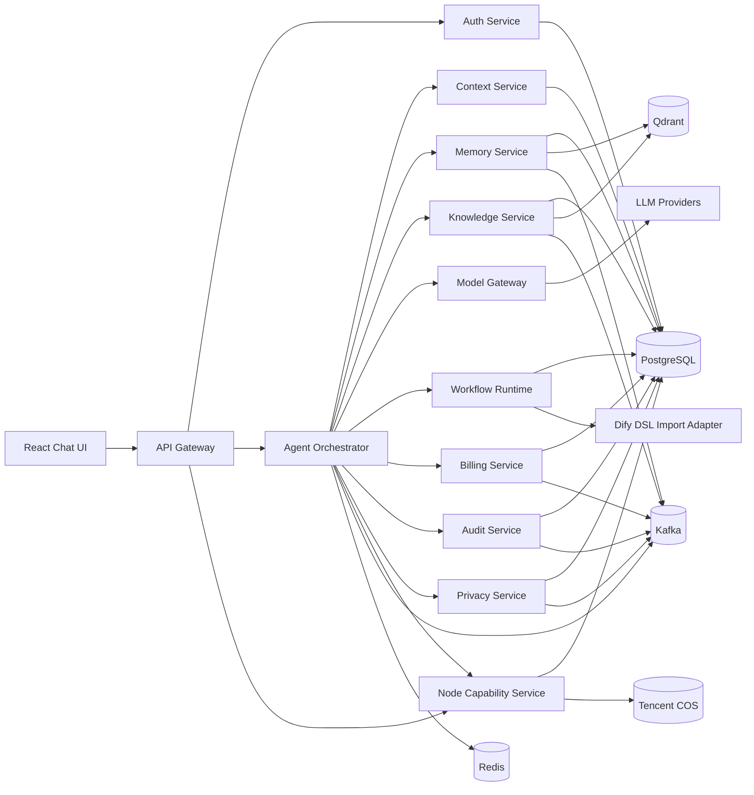

# 《心理学空间·自我探索Agent Pro》Java 微服务后端架构方案

> 历史稿说明：本文保留为上一阶段“Java 主控”方案参考，不再作为当前第一实施口径。当前主方案请优先阅读 [ARCHITECTURE_DOCS_INDEX.md](file:///Users/simon.wzb/Desktop/Workbench/mix/phyok/phyok-node/docs/ARCHITECTURE_DOCS_INDEX.md) 与 [AGENT_NODE_JAVA_DUAL_STACK_ARCHITECTURE.md](file:///Users/simon.wzb/Desktop/Workbench/mix/phyok/phyok-node/docs/AGENT_NODE_JAVA_DUAL_STACK_ARCHITECTURE.md)。

## 1. 文档定位

本文用于定义下一阶段 Java 微服务后端的工程化建设方案，目标不是做一个“能跑的 Demo”，而是作为后续真实生产系统的架构蓝图，重点覆盖：

- 企业级 Agent 后端架构
- PostgreSQL + Qdrant / pgvector 选型结论
- Dify 结果导入与兼容运行策略
- 上下文管理、RAG 隔离、超长上下文压缩
- Token 计费、审计、日志、微服务治理
- 面向真实大用户量的可扩展性、可维护性、并发能力与安全能力

本文默认：

- 现有 `phyok-node` 为当前在线/存量能力源，并将重构为 `node-capability-service`
- 后续新正式后端为 `Java + Spring`
- 前端后续为单聊天框、多模态输入风格
- 新系统外部统一前缀为 `/v2`
- 旧 `phyok-node` 的 `/app` 前缀继续保留，作为 legacy 兼容入口

---

## 2. 一句话结论

### 2.1 生产主方案

**推荐生产主方案：`PostgreSQL + Qdrant`，而不是把 `pgvector` 作为主检索引擎。**

### 2.2 结论原因

- `PostgreSQL` 负责：事务、关系数据、会话、消息、计费、审计、配置、工作流定义、租户与权限。
- `Qdrant` 负责：高并发向量检索、基于 payload 的隔离过滤、记忆碎片召回、RAG 召回。
- `pgvector` 不作为主路径，只保留两类用途：
- 小规模本地开发 / 预研验证
- 精简降级方案或回归对照方案

### 2.3 为什么不是纯 pgvector

纯 `pgvector` 的最大优势是“一库到底”，但在你的场景下，后期核心压力不是“能不能查向量”，而是：

- 在线事务和向量检索抢同一套 PostgreSQL 内存、I/O、连接池
- 计费、审计、会话、消息、工作流定义都在 PostgreSQL 中，向量索引会放大主库压力
- 面向大用户量时，RAG 与记忆召回通常会出现高频过滤条件：`tenant_id`、`user_id`、`app_id`、`memory_type`、`deleted=0`、`visibility`
- Agent 场景下向量检索的吞吐、尾延迟和扩容节奏，往往与 OLTP 数据库完全不同

因此更适合采用：

- **PG 管“真相与事务”**
- **Qdrant 管“召回与相似度”**

这也是更符合生产工程化的职责分离方案。

---

## 3. PostgreSQL + Qdrant 与 pgvector 选型对比

| 维度 | PostgreSQL + Qdrant | PostgreSQL + pgvector |
| --- | --- | --- |
| 关系数据能力 | 强，PG 原生负责 | 强，PG 原生负责 |
| 向量检索性能 | 强，适合高并发 ANN、过滤检索 | 中到强，适合中小规模 |
| 向量与事务资源隔离 | 好，分服务独立扩缩容 | 弱，共享同一 PG 集群 |
| 元数据过滤 | 强，Qdrant payload filter 很适合租户/用户/时间隔离 | 可以做，但复杂过滤下容易与事务负载争资源 |
| 与 SQL Join 的天然性 | 弱，需要“向量召回 ID -> PG enrich”二段式 | 强，天然 SQL join |
| 运维复杂度 | 较高，多一个基础设施 | 低，一套 PG 即可 |
| 生产可扩展性 | 高，向量层独立横向扩展更自然 | 中，大规模时 PG 压力会集中 |
| 一致性治理 | 需要 Outbox / MQ / 同步机制 | 最强，同事务内更新 |
| 成本节省 | 中长期更优，避免主库过度堆高规格 | 早期更省，后期可能因主库升配更贵 |
| 推荐结论 | **生产主方案** | **研发/降级备选** |

### 3.1 性能与节省角度的判断

如果系统处于：

- 向量规模小于数百万
- 检索 QPS 不高
- 团队运维能力有限

那么 `pgvector` 非常有性价比。

但你的目标明确是：

- 真实大用户量
- 多租户/多用户隔离
- 长期微服务化
- 多模态 + Agent + RAG + 审计 + 计费并行增长

这类系统更怕的是**所有压力打到一个 PG 集群**。因此：

- 短期最省事：`pgvector`
- 中长期最省总成本：`PostgreSQL + Qdrant`

### 3.2 与关系数据结合的最佳实践

推荐采用“**轻 payload + 主数据回表 enrich**”模式：

- `Qdrant` 中只存：
- `point_id`
- `tenant_id`
- `app_id`
- `user_id`
- `memory_fragment_id`
- `memory_type`
- `deleted`
- `visibility`
- `time_bucket`
- embedding

- `PostgreSQL` 中存：
- 全量记忆碎片正文
- 关系标签
- 版本号
- 软删除状态
- 审计状态
- 业务主记录

查询过程：

1. 应用层先请求 `Qdrant` 做召回
2. 只取回 `memory_fragment_id + score`
3. 再到 `PostgreSQL` 批量查详情
4. 最终在应用层合并排序与上下文

这样可以兼顾：

- 向量检索速度
- 关系数据可维护性
- 审计与数据主权

---

## 4. 生产目标

新 Java 后端必须满足以下目标：

- 单聊天框即可承接复杂 Agent 能力
- 支持文本、文档、图片、语音输入
- 支持用户级、会话级、RAG 级别严格隔离
- 支持大规模会话历史管理与超长上下文压缩
- 支持 Token 计费、成本核算、限流与配额
- 支持审计、回放、溯源、风险追踪
- 支持 Dify 导入与过渡运行
- 支持 MQ 驱动的异步化与解耦
- 支持微服务治理、灰度发布、熔断降级与链路追踪

---

## 4.1 Node 与 Java 职责结论

本项目后续采用“**Java 主控制面 + Node 能力微服务**”的双层分工：

- `Java` 负责主控制面：
- 多租户主鉴权
- JWT 主签发
- Agent 主编排
- 主 RAG 链路
- 计费主账本
- 审计总控
- 用户删除主编排

- `Node` 专注自己擅长的 I/O 与多模态能力：
- 多模态输入处理
- 文件处理
- 图片理解
- 语音转写
- 图片格式预处理
- 某些轻量级流式输出/中转
- 现有 `shared` 工具模块

设计原则：

- 不再让 `phyok-node` 充当主后端中枢
- 不再让 Node 承担主鉴权、主账务、主审计、主 RAG
- Node 中已有的优质业务逻辑和提示词策略，可在 Java 中按领域重写并复用

---

## 4.2 路由前缀策略

统一采用双前缀兼容：

- `/v2/*`：新系统正式入口，由 `Spring Cloud Gateway` 统一对外暴露
- `/app/*`：旧 `phyok-node` 兼容入口，面向现有客户端

约束：

- 新前端、新网关、新微服务只面向 `/v2`
- `/app` 只承担 legacy 兼容，不再承载新的主系统设计
- Node 在过渡期可同时提供 `/app` 与 `/v2` 两套路由，但语义必须分离

---

## 5. 技术基线建议

## 5.1 语言与框架

- JDK：`Java 21 LTS`
- Framework：`Spring Boot 3.5.x`
- AI：`Spring AI 2.0.x`
- API 风格：`REST + SSE`，内部服务补充 `gRPC`
- Validation：`Jakarta Validation`
- ORM：`MyBatis`
- Workflow / Rule：自研 Agent Runtime + Dify DSL Import Adapter

说明：

- `Java 21 LTS` 是成熟生产基线。
- `Spring AI 2.0` 已将 tool calling 提升为可组合 advisor 链，适合做 Agent 工程骨架。
- 数据访问层统一采用 `MyBatis + XML Mapper`，用于复杂查询、分页统计、审计回放、CMS 列表页与汇总指标。
- 不建议一开始就把运行时深度绑定在 Dify 本体内部，应该把 Dify 当作“工作流来源”和“可视化编排入口”。

## 5.2 基础设施

- Database：`PostgreSQL 16/17`
- Vector DB：`Qdrant 1.1x+`
- Cache：`Redis`
- MQ：`Kafka / 腾讯云 CKafka`
- Object Storage：`腾讯云 COS`
- Search / Log：`OpenSearch / ELK` 二选一
- Trace / Metrics：`OpenTelemetry + Micrometer + Prometheus + Grafana`
- Gateway：`Spring Cloud Gateway`
- Config：`Nacos / Apollo / Spring Cloud Config` 三选一
- Deploy：`Docker + Kubernetes(TKE)`

## 5.3 向量与检索基线

- Embedding：`BAAI/bge-m3`
- Semantic Chunking：`LLM API`
- Retrieval：`Qdrant dense + sparse hybrid`
- Rerank：`bge-reranker-v2` 或同等级 cross-encoder
- Recall Pipeline：`LLM Semantic Chunking -> Embedding -> Hybrid Recall -> PG Enrich -> Rerank -> Prompt Assembly`

说明：

- `bge-m3` 支持 dense、sparse、多语言与长文本输入，适合作为系统统一 embedding 基线。
- 自然语义分片明确采用 `LLM API`，优先保证复杂心理叙事的切分质量。
- 心理探索场景不应只依赖一次 dense 检索，而应采用 hybrid recall + rerank。
- 记忆碎片与知识文档严格分 collection，避免召回污染。
- 语义分片模型与 embedding 模型职责分离：前者负责“怎么切”，后者负责“怎么比”。

---

## 6. 总体架构



### 6.1 顶级后端技术架构图

```mermaid
flowchart TB
    U1[React Chat Web]
    U2[CMS Admin]
    U3[Legacy App]

    U1 --> GW[Spring Cloud Gateway /v2]
    U2 --> GW
    U3 --> LEGACY[/app legacy entry]

    GW --> AUTH[auth-service]
    GW --> ORCH[agent-orchestrator-service]
    GW --> OPS[ops-admin-service]
    GW --> NODE[node-capability-service]

    ORCH --> CTX[context-service]
    ORCH --> MEM[memory-service]
    ORCH --> KNO[knowledge-service]
    ORCH --> MODEL[model-gateway-service]
    ORCH --> CHUNK[semantic-chunk-service]
    ORCH --> BILL[billing-service]
    ORCH --> AUD[audit-service]
    ORCH --> PRI[privacy-service]

    MEM --> EMB[embedding-worker bge-m3]
    KNO --> EMB
    EMB --> QD[(Qdrant)]
    CHUNK --> LLM[LLM Chunking API]

    AUTH --> PG[(PostgreSQL)]
    CTX --> PG
    MEM --> PG
    KNO --> PG
    BILL --> PG
    AUD --> PG
    PRI --> PG
    OPS --> PG
    NODE --> PG

    MODEL --> RR[reranker-service]
    MODEL --> LLMG[LLM Providers]
    NODE --> COS[(Tencent COS)]
    ORCH --> MQ[(Kafka / CKafka)]
    MEM --> MQ
    KNO --> MQ
    BILL --> MQ
    AUD --> MQ
    PRI --> MQ
    ORCH --> REDIS[(Redis)]
```

### 6.2 设计原则

- **编排与存储分离**：Agent Orchestrator 不直接承担大规模存储逻辑。
- **事务与向量分离**：PG 保证事务，Qdrant 负责检索。
- **同步入口、异步重活**：聊天主链路只保留必要同步流程，向量化、摘要、审计入仓、计费汇总异步化。
- **领域规则前置**：心理探索门槛、记忆隔离、审计要求不交给模型自由发挥。
- **Java 控主、Node 控 I/O**：主鉴权、主编排、主账务、主审计放 Java；多模态与轻流式处理放 Node。
- **兼容现有 Node**：通过 `node-capability-service` 承接现有多模态与工具能力，逐步替换旧实现而非一次性重写。
- **检索先召回再重排**：记忆类探索统一采用 `hybrid recall + rerank`，避免单阶段向量检索误召回。
- **保留旧星图资产**：旧 `star-map` 的五个根节点继续保留，并映射到新 `timeline_root` 维度。
- **分片质量优先于调用成本**：自然语义分片由 `LLM API` 驱动，复杂文本不以廉价硬切替代。

---

## 7. 微服务拆分

## 7.1 P0 核心服务

### `agent-api-gateway`

职责：

- 前端统一入口
- 租户识别、JWT 校验、签名校验、WAF 后置策略
- 路由、限流、幂等键、SSE 代理
- 多端统一 `/v2` 前缀暴露

### `auth-service`

职责：

- 统一登录认证中心
- JWT / Refresh Token 主签发
- 多租户、应用、用户身份声明签发
- 会话管理、设备管理、黑名单与注销

说明：

- 邮箱验证码、邮件模板、验证码节流等能力可继续复用 Node 现有实现
- 但主认证中心必须收口到 Java

### `semantic-chunk-service`

职责：

- 调用 `LLM API` 做自然语义分片
- 输出结构化 chunk JSON
- 补充分片置信度、边界原因、候选标签
- 为 `memory-service` 与 `knowledge-service` 提供统一切分能力

说明：

- 该服务不负责生成 embedding
- 该服务不负责最终检索
- 该服务只回答“原始文本应该如何切成适合检索的语义单元”

### `agent-orchestrator-service`

职责：

- 单轮会话主编排
- 意图识别
- 工具调用编排
- 模型调用顺序控制
- 调度上下文、记忆召回、探索门槛
- 拼装最终回答

这是系统核心，不负责保存所有主数据，但负责“这一轮怎么跑”。

### `context-service`

职责：

- 会话历史管理
- 用户隔离、应用隔离、会话隔离
- 上下文窗口裁剪
- 分层摘要
- 长对话压缩
- 生成 prompt-ready context

### `memory-service`

职责：

- 记忆碎片新增/修复/软删除
- embedding 任务发起
- 写入 PostgreSQL 主表
- 写入 Qdrant 向量索引
- 记忆相似召回
- 用户级记忆隔离过滤

增强说明：

- 原始输入先通过 `semantic-chunk-service` 做 `LLM API` 自然语义分片
- 再使用 `bge-m3` 生成 dense / sparse 表征
- 每个记忆碎片必须落 `timeline_root`
- 为兼容旧星图，固定保留五个根节点：`EARLY`、`CHILDHOOD`、`STUDENT`、`WORK`、`TODAY`

### `knowledge-service`

职责：

- 文档型 RAG
- 文件切片、清洗、chunk、embedding
- 文档权限隔离
- 知识库检索

说明：

- 用户“记忆碎片”与“知识库文档”应分开服务或至少分开逻辑域，不能混成同一检索池。
- 文档切片升级为 `LLM API 语义切分 + token 边界校验 + overlap` 的正式流水线。

### `model-gateway-service`

职责：

- 屏蔽多模型差异
- Provider fallback
- Token 统计归一
- Prompt 审计打点
- 模型路由与熔断

### `billing-service`

职责：

- Token 计费
- 模型成本核算
- 套餐余额/权益
- 配额限流
- 账单明细

说明：

- Apple IAP 验票等既有 Node 逻辑可作为过渡下游能力保留
- 但账务主账本、扣费流水、配额口径统一收口在 Java + PostgreSQL

### `audit-service`

职责：

- 审计轨迹留存
- Prompt/Tool/RAG/Answer 回放
- 风险行为告警
- 人工复核留痕

### `privacy-service`

职责：

- 用户删除主编排
- 数据清理任务下发
- 合规删除审计
- 多数据源删除补偿与回放

说明：

- Node 中既有隐私清理逻辑继续保留，但只作为删除执行器之一
- 删除主编排、任务状态和合规审计必须由 Java 掌控

## 7.2 P1 扩展服务

### `media-service`

职责：

- OCR
- ASR
- 图片理解
- 文档解析
- 文件入 COS

说明：

- `media-service` 的第一阶段实现推荐直接由 `phyok-node` 演进而来
- Node 保留自己在文件处理、图片理解、语音处理、轻量流式中转上的优势
- 该服务使用 PostgreSQL 记录媒体资产与作业元数据，不再承担主 RAG 与主鉴权职责

### `workflow-runtime-service`

职责：

- 自研工作流执行
- Dify DSL 导入编译
- 运行时节点映射
- 工作流版本管理

### `ops-admin-service`

职责：

- 控制台、运营配置、人工审核、灰度开关

增强说明：

- 提供核心指标：用户、付费、投诉、审计、系统资源
- 所有列表页支持分页、过滤、导出任务
- 建议首个管理员账号为 `simonwzb`
- 初始密码在部署时通过环境变量注入，首次登录强制修改，不写死到仓库

### `legacy-node-adapter-service`

职责：

- 承接现有 `phyok-node` 能力
- 对旧 API 做 Java 领域语义包装
- 降低新旧系统耦合

### `node-capability-service`

职责：

- 承接 `phyok-node` 演进出的 `/v2/media/*`、`/v2/stream/*`、`/v2/tool/*`
- 提供多模态输入处理、文件解析、图片理解、语音转写、图片格式预处理
- 提供 `shared` 工具能力：隐私脱敏、风险预警、图像预处理
- 承担轻量级流式输出/中转

约束：

- 不承担多租户主鉴权
- 不承担 JWT 主签发
- 不承担主账务
- 不承担审计总控
- 不承担主聊天编排
- 不承担主 RAG 链路
- 不承担用户删除主编排

说明：

- 该服务是 `phyok-node` 的目标定位
- Java 系统通过网关或内部调用消费其能力，而不是反过来被 Node 驱动
- 支持文件解析、图片理解、语音转写结果回写 PG 元数据
- 不直接沉淀为正式记忆碎片，由 Java 编排决定是否入记忆域

---

## 8. 工程化核心模块

## 8.1 上下文管理

### 目标

- 支持海量历史会话
- 支持用户/应用/会话/RAG 的严格隔离
- 支持上下文超长自动压缩
- 支持可解释的上下文构建

### 上下文分层

每一轮回答不直接把所有历史丢给模型，而是拼装四层：

1. **系统层**
- 系统提示词
- 应用策略
- 安全策略

2. **会话窗口层**
- 最近 N 轮原始对话

3. **压缩摘要层**
- 历史摘要
- 中程摘要
- 主题摘要

4. **检索增强层**
- 记忆碎片召回
- 知识库文档召回
- 当前文件解析结果

### 超长上下文压缩策略

采用“分层摘要 + 结构化压缩”：

- `L1`：最近 6 到 12 轮原始消息保留
- `L2`：每 20 到 30 轮生成一次会话摘要
- `L3`：按主题生成长期摘要，例如“关系冲突”“原生家庭”“自我评价”

摘要触发异步化：

- 聊天结束后投递 Kafka
- `context-service` 异步生成摘要
- PG 持久化版本化摘要

### 隔离维度

上下文查询必须带以下隔离键：

- `tenant_id`
- `app_id`
- `user_id`
- `conversation_id`
- `knowledge_scope`

任何检索或上下文聚合接口，都不能只靠前端传一个 `userId` 简单拼接。

---

## 8.2 RAG 隔离

RAG 必须至少支持四层隔离：

- 租户隔离
- 应用隔离
- 用户隔离
- 数据域隔离（记忆域 / 文档域）

### Qdrant payload 约定

建议统一 payload 字段：

- `tenant_id`
- `app_id`
- `user_id`
- `conversation_id`
- `memory_fragment_id`
- `knowledge_doc_id`
- `data_domain`
- `visibility`
- `deleted`
- `created_at`
- `time_bucket`

### 检索原则

- 记忆召回优先按 `user_id` + `data_domain=memory`
- 文档召回优先按 `tenant_id/app_id` + `data_domain=knowledge`
- 禁止把全局知识和个人隐私记忆放在同一 collection 无差别召回

### 记忆检索主链路

1. 用户输入当前心理问题
2. `memory-service` 做 query normalization
3. 使用 `bge-m3` 生成 dense 向量与 sparse 特征
4. 按 `tenant_id + app_id + user_id + searchable=true` 到 `user_memory_fragments` hybrid recall
5. Qdrant 返回 `fragment_id + score + minimal payload`
6. 应用层批量回表 PostgreSQL enrich 正文、标签、时间根节点
7. reranker 对候选记忆碎片二次排序
8. orchestrator 拼装“基于记忆依据”的探索上下文

约束：

- 探索类问题的检索对象固定为“用户记忆碎片”
- 记忆少于 5 条时，不进入探索分析
- 探索回答不反写为事实记忆

### 语义分片链路

1. 接收标准化后的文本
2. 调用 `semantic-chunk-service`
3. 向 `LLM API` 发送结构化分片请求
4. 校验 JSON schema、chunk 数量、token 长度、边界合法性
5. 为每个 chunk 生成：
- `fragment_type`
- `timeline_root`
- `topic_tags`
- `emotion_tags`
- `chunk_confidence`
6. 写入 `memory_fragment` / `knowledge_chunk`
7. 投递异步 embedding 任务

约束：

- LLM 输出必须经过服务端 schema 校验
- 分片失败允许重试，但不允许无校验直接粗暴入库
- 大模型负责“语义边界判断”，embedding 负责“向量表示”

---

## 8.3 计费管理

### 目标

- 按模型、用户、会话、工作流、工具调用精确计费
- 能追溯 token 成本
- 能做套餐额度、每日限额、风控限额

### 计费拆分

建议区分三层：

1. **原始计量层**
- prompt tokens
- completion tokens
- embedding tokens
- rerank tokens
- OCR/ASR 次数

2. **计费规则层**
- 套餐换算
- 模型倍率
- 免费额度
- 补贴/活动

3. **账务层**
- 账户余额
- 扣费流水
- 日汇总/月汇总

### 记账模型

同步主链路只做：

- 本轮预占额度校验
- 结果返回后写入使用事件

异步做：

- 费用归集
- 月账单
- 成本报表

事件主题建议：

- `token.usage.recorded`
- `billing.charge.requested`
- `billing.charge.completed`
- `billing.alert.threshold_reached`

---

## 8.4 审计管理

### 为什么必须重视

你的产品是心理探索场景，审计不是附属功能，而是核心系统能力。

### 审计对象

- 用户原始输入
- 多模态解析结果
- 意图识别结果
- 召回记忆碎片 ID 与分数
- 召回知识文档 ID 与分数
- 工具调用参数
- 模型请求摘要
- 模型输出
- 最终回复
- 人工修正记录

### 审计分层

- `audit_event`：结构化审计事件
- `audit_trace`：一次完整对话链路
- `audit_snapshot`：争议轮次可回放快照

### 数据安全

- 敏感字段默认脱敏入日志
- 审计数据与业务数据分库/分表治理
- 审计查询需更高权限

---

## 8.5 日志管理

统一结构化日志，至少包含：

- `trace_id`
- `span_id`
- `tenant_id`
- `app_id`
- `user_id`
- `conversation_id`
- `request_id`
- `service`
- `event_name`
- `status`
- `latency_ms`

### 日志原则

- 业务日志、审计日志、安全日志分级
- 不直接打印原始 prompt 全文到普通日志
- 错误日志必须可定位到具体 conversation
- 大文本内容只保留引用 ID 或摘要

---

## 8.6 微服务治理

必须具备以下治理能力：

- 服务注册与发现
- 配置中心
- 熔断、重试、限流、隔离舱
- 链路追踪
- 灰度发布
- 金丝雀发布
- 统一鉴权
- 统一错误码

### 推荐治理栈

- Gateway：`Spring Cloud Gateway`
- Config：`Nacos` 或 `Apollo`
- Trace：`OpenTelemetry`
- Metrics：`Micrometer + Prometheus`
- Circuit Breaking：`Resilience4j`
- Secret：`K8s Secret + 腾讯云 KMS`

---

## 9. Dify 兼容与导入运行策略

## 9.1 目标

用户希望后续能“把 Dify 的结果导入后直接运行”。可行，但不建议做成“强依赖 Dify 生产运行时”。

### 正确路线

**把 Dify 当作工作流来源，而不是最终唯一运行时。**

## 9.2 Dify 兼容设计

基于 Dify 官方支持 DSL 导出/导入，应用可导出为 YAML DSL 文件：

- Dify 应用支持导出 DSL
- Dify 应用可以通过 DSL 重建

因此新 Java 架构建议支持两种模式：

### 模式 A：Bridge Mode

- Dify 继续负责执行
- Java 系统只负责：
- 用户鉴权
- 计费
- 审计
- 上下文
- RAG 隔离
- 调用已发布 Dify API

适合：

- 快速复用既有 Dify 流程
- 迁移过渡期

### 模式 B：Native Runtime Mode

- 导入 Dify DSL
- 解析为内部工作流定义
- 由 `workflow-runtime-service` 在 Java 侧执行

适合：

- 进入正式生产
- 统一审计、计费、风控、性能治理

## 9.3 实现方式

新增 `dify-import-adapter` 模块，负责：

- 读取 Dify DSL YAML
- 解析节点、边、变量、模型参数
- 映射到内部工作流定义表
- 对不支持的节点做兼容标记

### 节点兼容策略

- 可原生映射：
- start
- condition
- llm
- code
- http request
- knowledge retrieval
- tool

- 需要桥接：
- Dify 专有扩展节点
- 插件生态中特定 node

### 推荐结论

**短期先做 Bridge Mode，长期做 Native Runtime Mode。**

这样既能快速承接 Dify 成果，也不会把正式生产系统锁死在 Dify 内部运行时。

---

## 10. 数据模型建议

## 10.1 PostgreSQL 主表

建议核心表：

- `tenant`
- `app`
- `user_account`
- `conversation`
- `conversation_message`
- `conversation_summary`
- `memory_fragment`
- `memory_fragment_relation`
- `memory_star_map_snapshot`
- `knowledge_document`
- `knowledge_chunk`
- `workflow_definition`
- `workflow_version`
- `token_usage_event`
- `billing_account`
- `billing_ledger`
- `audit_event`
- `audit_trace`

## 10.2 Qdrant collections

建议至少拆两个 collection：

- `user_memory_fragments`
- `knowledge_chunks`

补充约束：

- `user_memory_fragments` payload 中必须带 `timeline_root`
- 该字段用于兼容旧星图五根节点展示与按时间阶段过滤

不建议把两类数据混在一个 collection。

## 10.3 一致性策略

采用 `PG 主写 + Outbox + MQ + Qdrant 同步`：

1. 业务事务先写 PostgreSQL
2. 同事务写 `outbox_event`
3. Outbox relay 投递 Kafka
4. `memory-service` / `knowledge-service` 消费事件同步 Qdrant

好处：

- 避免应用层双写失败不一致
- 可重放
- 可补偿

---

## 11. 安全设计

## 11.1 外围防护

- 腾讯云 WAF
- API Gateway 限流
- IP/设备指纹风控
- 签名校验与重放保护

## 11.2 应用层安全

- JWT + Refresh Token
- 租户级权限校验
- 资源级鉴权
- 上传文件 MIME 校验
- Prompt Injection 防护
- 工具调用白名单

## 11.3 数据安全

- PostgreSQL at-rest 加密
- COS 私有桶
- Qdrant 内网部署
- 敏感字段加密存储
- 审计数据最小可见原则

## 11.4 Agent 特有安全

- 工具调用参数校验
- 结果输出敏感词/越权检测
- 高风险场景人工接管
- 重要工作流审批开关

---

## 12. 并发与性能设计

## 12.1 并发原则

- 聊天主链路同步最短化
- embedding、摘要、审计归档、计费汇总全部异步
- 读写分离
- 缓存热点会话

## 12.2 性能关键点

### PostgreSQL

- 读写分离
- PgBouncer
- 分区表：消息表、审计表、token 事件表按时间分区
- 大文本与热字段拆分
- 复杂统计与分页查询统一由 MyBatis 显式 SQL 控制

### Qdrant

- collection 按业务域拆分
- payload index 建立在高频过滤字段上
- 大文本不进 payload
- 查询只回 ID + score + 少量元信息

### Redis

- 会话热点缓存
- 幂等键
- 限流计数器
- Prompt 构建结果短缓存

### 轻量服务器约束

- 腾讯云轻量应用服务器优先采用 `Docker Compose` 单机编排
- 若需要 K8s 体验，优先 `k3s`，不建议在资源紧张机器上直接跑完整 TKE 控制面
- 一键部署、日志、告警、清理策略见独立运维文档

---

## 13. 可观测性

## 13.1 统一 Trace

每个请求贯通：

- HTTP 入口
- Agent 编排
- RAG 检索
- Tool Calling
- Model 调用
- Billing 记账
- Audit 写入

关键关联键：

- `trace_id`
- `conversation_id`
- `workflow_run_id`
- `billing_event_id`

## 13.2 指标建议

- QPS
- p50/p95/p99 延迟
- Token 消耗
- 模型调用错误率
- Qdrant 检索耗时
- 命中记忆碎片数
- 摘要生成成功率
- 计费失败率
- 审计写入积压

---

## 14. 建议的工程目录

建议新建独立仓库：`phyok-java`

```text
phyok-java/
  apps/
    agent-api-gateway/
    ops-admin-service/
  services/
    agent-orchestrator-service/
    context-service/
    memory-service/
    knowledge-service/
    model-gateway-service/
    workflow-runtime-service/
    billing-service/
    audit-service/
    media-service/
    legacy-node-adapter-service/
  libs/
    phyok-common-core/
    phyok-common-web/
    phyok-common-security/
    phyok-common-observability/
    phyok-common-mq/
    phyok-common-rag/
    phyok-common-agent/
    phyok-common-billing/
  deploy/
    docker/
    helm/
    k8s/
  docs/
    ADR/
    architecture/
```

### 目录原则

- `apps`：面向外部入口
- `services`：业务微服务
- `libs`：共享基础库
- `deploy`：部署资产
- `docs`：架构与 ADR

---

## 15. 部署拓扑建议

生产环境建议至少拆为：

- `gateway` 节点池
- `core-services` 节点池
- `async-workers` 节点池
- `stateful` 节点池

云资源建议：

- TKE：承载业务容器
- Tencent CLB / Gateway：统一入口
- Tencent PostgreSQL 或自建高可用 PG
- 自建 Qdrant 集群
- CKafka
- COS
- Prometheus + Grafana

---

## 16. 迁移策略

### 阶段 1：外围收口

- 保留 `phyok-node`
- Java 先接管统一网关、Auth、审计、计费、上下文
- 外部新增 `/v2`，旧 `/app` 继续可用

### 阶段 2：Node 能力下沉

- 将 `phyok-node` 重构为 `node-capability-service`
- 新增 PG 元数据层，承接媒体资产、支付过渡数据、任务记录
- 保留 Node 擅长的文件处理、图片理解、语音转写、轻流式能力

### 阶段 3：记忆与 RAG 外移

- 新记忆碎片与知识库进入 PG + Qdrant
- 主 RAG 链路迁至 Java
- Node 不再承担任何主 RAG 职责

### 阶段 4：Agent 主链路切换

- 聊天主链路切到 Java Orchestrator
- 主聊天 SSE 切到 Java
- Node 退为 capability service + legacy adapter

### 阶段 5：Dify 融合

- 先 Bridge Mode
- 再 Native Runtime Mode

---

## 17. 相关补充文档

- PostgreSQL 设计：[POSTGRESQL_SCHEMA_DESIGN.md](file:///Users/simon.wzb/Desktop/Workbench/mix/phyok/phyok-node/docs/POSTGRESQL_SCHEMA_DESIGN.md)
- Qdrant 与向量检索：[QDRANT_COLLECTION_PAYLOAD_DESIGN.md](file:///Users/simon.wzb/Desktop/Workbench/mix/phyok/phyok-node/docs/QDRANT_COLLECTION_PAYLOAD_DESIGN.md)
- 语义分片专项：[MEMORY_SEMANTIC_CHUNKING_ARCHITECTURE.md](file:///Users/simon.wzb/Desktop/Workbench/mix/phyok/phyok-node/docs/MEMORY_SEMANTIC_CHUNKING_ARCHITECTURE.md)
- Node 能力服务定位：[NODE_V2_SERVICE_POSITIONING.md](file:///Users/simon.wzb/Desktop/Workbench/mix/phyok/phyok-node/docs/NODE_V2_SERVICE_POSITIONING.md)
- 轻量服务器运维：[DEPLOYMENT_OPS_LIGHT_SERVER.md](file:///Users/simon.wzb/Desktop/Workbench/mix/phyok/phyok-node/docs/DEPLOYMENT_OPS_LIGHT_SERVER.md)
- CMS 后台：[CMS_ADMIN_ARCHITECTURE.md](file:///Users/simon.wzb/Desktop/Workbench/mix/phyok/phyok-node/docs/CMS_ADMIN_ARCHITECTURE.md)
- React 前端架构：[README.md](file:///Users/simon.wzb/Desktop/Workbench/mix/phyok/phyok-web/README.md)

---

## 18. 最终推荐

### 18.1 架构结论

正式生产架构建议采用：

- `Java 21 + Spring Boot + Spring AI`
- `PostgreSQL + Qdrant`
- `Redis + Kafka`
- `Docker + TKE`

### 18.2 数据库结论

**主方案选择：`PostgreSQL + Qdrant`**

原因：

- 更适合大用户量与高并发 Agent 检索
- 更利于事务层与向量层解耦
- 更利于独立扩容与抗风险
- 更适合后期审计、计费、治理并行增长

`pgvector` 的定位：

- 本地研发
- 小规模验证
- 降级备选

### 18.3 Dify 结论

**Dify 可以保留，但定位应为：工作流来源与过渡执行器。**

正式生产系统不能把命脉长期绑死在 Dify 内部运行时，最终需要：

- 自研 Java Agent Runtime
- Dify DSL Import Adapter
- 统一计费、统一审计、统一上下文与统一治理

---

## 19. 下一步建议

在本文基础上，下一轮建议继续产出 4 份文档：

1. `服务边界与接口清单`
2. `PostgreSQL 表结构设计`
3. `Qdrant Collection 与 Payload 设计`
4. `Dify DSL 导入映射设计`

这 4 份文档完成后，就可以正式进入工程初始化阶段。
